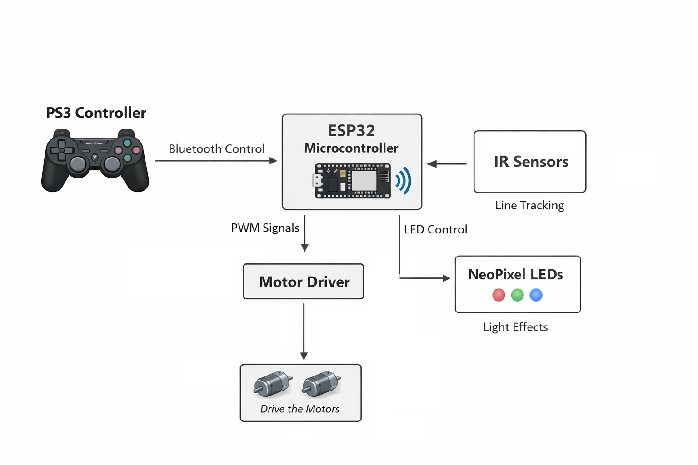

# ESP32 Line Following & PS3 Controlled Robot

---

## Project Overview

This project implements a **dual-mode smart robot** using an ESP32:

1. **Line Following Mode** – Automatically follows a line using IR sensors.  
2. **PS3 Controller Mode** – Controlled manually via a PS3 Bluetooth controller.  

The robot integrates:

- **NeoPixel LEDs** for visual feedback (speed & status)  
- **L298N motor drivers** for 4 DC motors  
- **PWM control** for precise motor speed adjustments  
- **Fail-safe auto-restart** if PS3 controller disconnects  

---

## Block Diagram

> **Note:** IR sensors are inputs to the ESP32, motors are driven via L298N, and NeoPixels are controlled directly from ESP32.

---

## Hardware

- **ESP32 Dev Board**  
- **L298N Motor Driver**  
- **DC Motors** (4-wheel drive)  
- **IR Sensors** (Front & Back)  
- **NeoPixel Strip** (30 LEDs)  
- **PS3 Controller** (Bluetooth)  
- **Battery / Power Supply**  

---

## Software

- **Arduino IDE** (ESP32 support)  
- **Libraries:**
  - `Ps3Controller` – PS3 Bluetooth connection  
  - `Adafruit_NeoPixel` – LED control  

---

## Features

- Dual mode operation: **Line following / Manual PS3 control**  
- Adjustable speed via PS3 buttons (1–9 scale)  
- Visual feedback using NeoPixel LEDs  
- Forward, backward, left, right, diagonal movement  
- IR-based line-following with configurable thresholds  
- Non-blocking sensor reading loop  
- Fail-safe auto-restart if controller disconnects  
- Modular, expandable, and user-friendly code  

---

## Pinout / Wiring Overview

| Component              | ESP32 Pin |
|------------------------|-----------|
| IR Front Left          | 34        |
| IR Front Mid           | 35        |
| IR Front Right         | 32        |
| IR Back Left           | 25        |
| IR Back Mid            | 26        |
| IR Back Right          | 27        |
| NeoPixel Data          | 14        |
| L298N ENA (Left Motors)| 15        |
| L298N ENB (Right Motors)| 13       |
| Motor Inputs           | 4, 5, 16, 17, 18, 19, 22, 23 |

---

## Usage

1. Connect all hardware according to the pinout table.  
2. Upload the code to the ESP32 using Arduino IDE.  
3. Power the robot and wait for NeoPixel initialization.  
4. Connect the PS3 controller via Bluetooth (`Ps3.begin(MAC_ADDRESS)`).  
5. Press **PS button** to toggle between manual and line-following mode.  
6. Use analog sticks and buttons for movement and speed control.  

---

## NeoPixel LED Indicators

- LEDs show current **speed** and robot **status**.  
- Colors can be customized in the code.  

---

## Line-Following

- When **Line_follower mode** is active, the robot autonomously follows a line using IR sensors.  
- Thresholds are configurable for different track surfaces.  

---

## Fail-Safe

- ESP32 auto-restarts if the PS3 controller disconnects for more than 10 seconds.  
- Motors stop safely when no command is received.  

---

## License

This project is licensed under the **MIT License**.  

---

## Author

**Abdelrahman Elnahrawy**  
Dynamic Systems Egypt
